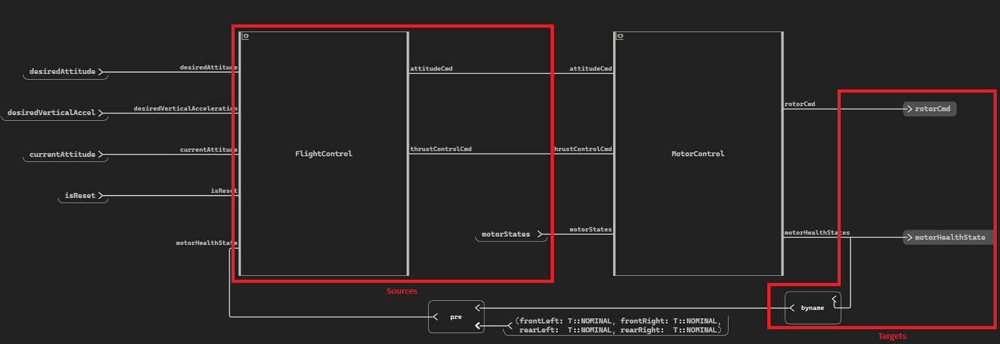

Diagram Navigation
==================
In this section, we present how we can navigate in an operator diagram. We start giving the basic methods to move
through a diagram and we finish by a simple navigation between two objects using these methods. We use the
**QuadFlightControl** example provided with Scade One. This example is located in the ``examples/QuadFlightControl``
folder in the Scade One installation directory. 

Diagram Block
-------------
The operator's diagram block can be accessed with the :py:meth:`ansys.scadeone.swan.Operator.diagrams()` method.

.. code:: python

    diag = next(motor_control_op.diagrams(), None)

Once we have the **MotorControl** diagram block, we can get the list of diagram objects (blocks, wires, ...) and the
connections between them (sources or targets). The figure below presents those blocks for our exemple:

Diagram Objects
---------------
To get the source and target objects, we need to get the diagram objects using the
:py:meth:`ansys.scadeone.swan.Diagram.objects()` method. We can filter by :py:class:`ansys.scadeone.swan.Block`
to get the blocks list.

.. code:: python

    blocks = list(filter(lambda obj: isinstance(obj, swan.Block), diag.objects))

Sources and Targets
-------------------
Using the **MotorControl** diagram block, we can get the operator's sources using the
:py:meth:`ansys.scadeone.swan.DiagramObject.sources()` method:

.. code:: python

    # Get the 'MotorControl' block diagram
    motor_control_block = next(filter(lambda block: block.instance.path_id.full_name == 'MotorControl', blocks))

    # Get the 'MotorControl' sources ('FlightControl', 'motorStates')
    sources = motor_control_block.sources()

We can also get the operator's targets using the
:py:meth:`ansys.scadeone.swan.DiagramObject.targets()` method:

.. code:: python

    # Get the 'MotorControl' targets ('motorHealthState', 'rotorCmd',  the 'byname' group)
    targets = motor_control_block.targets()

Navigate from Input to Output
-----------------------------
We can navigate inside the **MotorControl** operator selecting a starting and an ending point.
We take **attitudeCmd** input as starting point and we navigate through the wires to get the blocks on the route
until we arrive at the ending point, **rotorCmd**.

.. figure:: images/input_output_navigation.png

First, we get the **attitudeCmd** input with its fields.

.. code:: python

    def input_filter(obj: swan.DiagramObject):
        if not isinstance(obj, swan.ExprBlock):
            return False
        if not isinstance(obj.expr, swan.StructProjection):
            return False
        return str(obj.expr.expr.id) == 'attitudeCmd'

    # Get the 'attitudeCmd' fields from the diagram (expression blocks)
    attitude_cmd_fields = list(filter(lambda obj: input_filter(obj), diag.objects))

Once we have the input, we can move to the next object diagram using
the :py:meth:`ansys.scadeone.swan.DiagramObject.targets()` method. For each object diagram target, we can move to the
next object, and so on until we arrive at the output. For each move, we can save the navigated object.

.. code:: python

    def contains_output(objs):
        return next(filter(lambda obj: isinstance(obj, swan.DefBlock), objs), None) is not None

    # Get the blocks following the flows from the 'attitudeCmd' input to the 'rotorCmd' output
    blocks = set()
    while not contains_output(objs):
        targets = set()
        for obj in objs:
            for target in obj.targets():
                targets.add(target[0])
                if isinstance(target[0], swan.Block):
                    blocks.add(target[0])
        objs = targets

Complete Example
________________

This is the complete script for the diagram navigation section.

.. literalinclude:: quad_flight_control.py